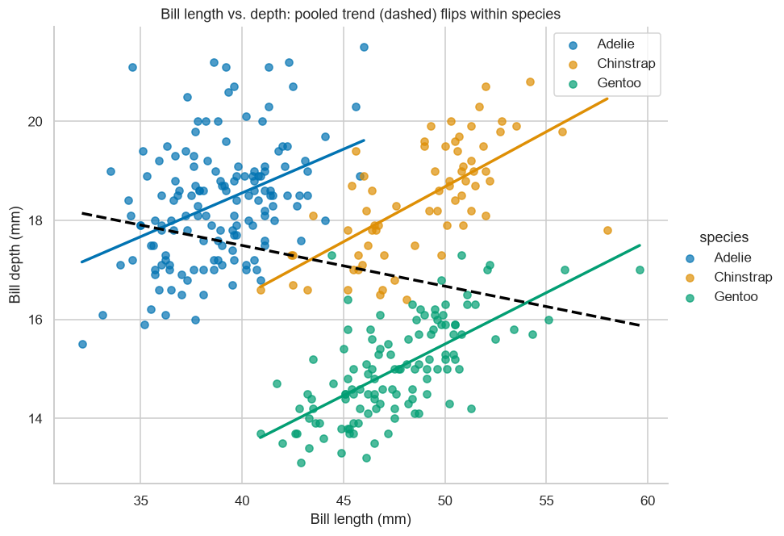
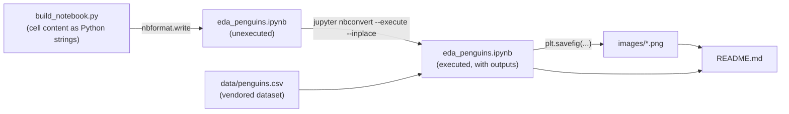

# Palmer Penguins — Exploratory Data Analysis

A storytelling EDA notebook that finds a genuine Simpson's-paradox reversal in the Palmer Penguins bill measurements.


> **AI Engineer Roadmap — Project 0.2**
> *Teaches: matplotlib/seaborn, statistical intuition, communicating with data.*
> *Done when: a non-technical person reads the notebook and understands the finding.*

## What it does

This is a single-notebook EDA of the [Palmer Penguins](https://allisonhorst.github.io/palmerpenguins/)
dataset (344 penguins, 3 species, recorded at Palmer Station, Antarctica). It
walks from "what is this data?" to one genuinely surprising, verifiable
finding: **Simpson's paradox** in the relationship between bill length and
bill depth.

👉 **[Open the notebook with all charts rendered](eda_penguins.ipynb)** — it is
committed fully executed, so it renders on GitHub with no setup required to read it.

### The finding in one picture



Pooled across all penguins, **bill length and bill depth are negatively
correlated** (dashed line, *r* = **−0.23**): longer bills look *shallower*. But
split by species, the relationship **flips to positive** in every group:

| Group | Correlation (bill length vs. depth) |
| --- | ---: |
| All penguins (pooled) | **−0.23** |
| Adelie | +0.39 |
| Chinstrap | +0.65 |
| Gentoo | +0.65 |

The species occupy different regions of the plot (Gentoo: long + shallow
bills; Adelie: short + deep), so pooling them draws a misleading
*between-group* line that points the **opposite way** from the real
*within-group* relationship. A correlation, a feature importance, or an A/B
test computed on pooled data can reverse once you condition on a hidden
variable (here, species; in production, often segment, device, or time
period) — always check that a relationship survives inside the subgroups.

The notebook also covers: data-quality checks (dtypes, missing values, and
why incomplete rows are dropped rather than imputed), species/island
composition, distributions of all four body measurements, the consistent
male/female body-mass gap within each species, and the full correlation
matrix — before arriving at the paradox above.

## Architecture

The notebook is generated from a script rather than hand-edited, so it
regenerates identically and stays easy to review in a diff. Numbers and
charts below are computed from the vendored CSV, not fetched from anywhere at
run time.



There is no model, no train/test split, and no service — this is a pure data
storytelling artifact: one script builds one notebook that reads one CSV and
writes five PNGs.

## Quickstart

```bash
python -m venv .venv
source .venv/bin/activate          # Windows: .\.venv\Scripts\activate
pip install -r requirements.txt

# Regenerate the notebook structure from build_notebook.py and execute it:
python build_notebook.py
jupyter nbconvert --to notebook --execute --inplace eda_penguins.ipynb

# ...or just open it interactively:
jupyter lab eda_penguins.ipynb
```

## Project structure

```
.
├── build_notebook.py     # generates eda_penguins.ipynb from a list of (markdown|code) cells via nbformat
├── eda_penguins.ipynb    # the analysis notebook, committed pre-executed with outputs + charts
├── data/
│   └── penguins.csv      # vendored dataset — no network needed to reproduce
├── images/                # 5 PNGs exported by the notebook, embedded in this README
│   ├── 01_composition.png
│   ├── 02_distributions.png
│   ├── 03_mass_by_sex.png
│   ├── 04_correlation.png
│   └── 05_simpsons_paradox.png
├── requirements.txt       # pinned dependencies (see comments for version-sensitive pins)
└── LICENSE                # MIT (code)
```

## Key design decisions

- **Notebook-as-code.** `build_notebook.py` keeps every cell as a plain Python
  string in one ordered list, so the notebook's structure is diff-friendly and
  reproducible instead of living only in hand-edited JSON.
- **Vendored data.** `data/penguins.csv` is committed so the notebook is fully
  reproducible offline and won't break if an external mirror moves or goes down.
- **Drop, don't impute.** A handful of rows (11 of 344) have missing
  measurements or `sex`; they are dropped for the measurement analyses rather
  than imputed, since inventing body measurements the study didn't record
  would be worse than losing a few rows.
- **Committed outputs.** The notebook, its outputs, and the exported PNGs are
  all committed (see `.gitignore` for the explicit rationale) so the finished
  analysis is viewable on GitHub without anyone having to run anything.
- **Consistent per-species color.** A fixed `SPECIES_COLORS` mapping is used
  in every chart so the same color always means the same species.

## Limitations

- **No automated verification.** Nothing currently checks that the notebook
  still executes cleanly or that the reported correlations (−0.23, +0.39,
  +0.65, +0.65) haven't drifted — this rests on manual re-execution before commit.
- **Version-sensitive dependencies.** The subgroup-correlation step relies on
  pandas's `include_groups` keyword (needs pandas ≥2.2), and one chart call
  relies on seaborn's pre-0.14 `palette`-without-`hue` behavior (seaborn is
  pinned `<0.14` as a stopgap; see `requirements.txt` for details and the
  audit for the underlying fix).
- **Single dataset, single story.** This is a demonstration notebook built to
  teach one statistical lesson (Simpson's paradox), not a general-purpose EDA
  template or a reusable analysis library.
- **No CI.** There is no workflow that re-executes the notebook on push, so
  regressions would only be caught by a human re-running it.

## Roadmap

- Add a CI workflow that runs `build_notebook.py` + `nbconvert --execute` on
  every push and fails if the notebook errors.
- Add a lightweight regression check (e.g. `nbval`, or a small pytest
  asserting the reported correlations stay within expected sign/range) so the
  paradox claim can't silently drift.
- Fix the `seaborn.countplot` call to assign `hue` explicitly instead of
  relying on the deprecated `palette`-without-`hue` path, then drop the
  `<0.14` seaborn cap.

## Credits

Data: Dr. Kristen Gorman and the Palmer Station LTER, packaged as
`palmerpenguins` by Allison Horst. Distributed under CC0.

## License

MIT (code). Dataset is CC0.
